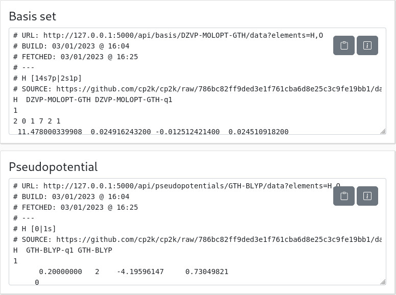
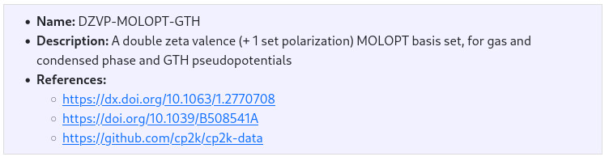
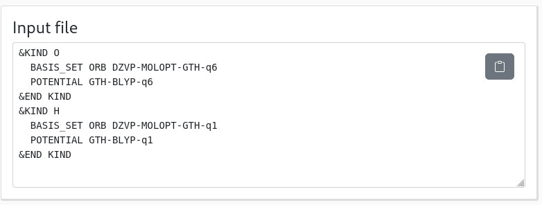
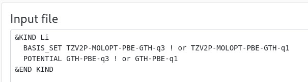
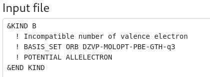

# How to use the web interface?

!!! info
    If you are not familiar with the concept of basis set and pseudopotentials, check out [this introduction](basis_sets_and_pseudos.md).

As usual with quantum chemistry calculations, to run CP2K, you need a geometry and a method.
For the latter, if you want to use the GPW method (and, to some extent, the GAPW method), you will need to pick a basis set and a matching pseudopotential, which is the goal of this web interface.

## Example

Say you [want to optimize the water molecule](https://www.cp2k.org/howto:geometry_optimisation).
In particular, your input looks like:

```
&FORCE_EVAL
    METHOD QS
    &SUBSYS
        &CELL
          ABC 12.4138 12.4138 12.4138
        &END CELL
        &COORD
          O      12.235322       1.376642      10.869880
          H      12.415139       2.233125      11.257611
          H      11.922476       1.573799       9.986994
        &END COORD
        &KIND H
          BASIS_SET ??  ! <- pick one
          POTENTIAL ??  ! <- pick one
        &END KIND
        &KIND O
          BASIS_SET ??  ! <- pick one
          POTENTIAL ??  ! <- pick one
        &END KIND
    &END SUBSYS
    &DFT
        BASIS_SET_FILE_NAME  BASIS_SET      ! <- should contain your basis set(s)
        POTENTIAL_FILE_NAME  GTH_POTENTIALS ! <- should contain your pseudo(s)
        &XC
          &XC_FUNCTIONAL ??  ! <- pick one
          &END XC_FUNCTIONAL
        &END XC
        # (...)
    &END DFT
&END FORCE_EVAL
# (...)
```

### If you already know the method

If you already know which basis set and pseudopotential you want to use, say `DZVP-MOLOPT-GTH` with `GTH-BLYP` (and the BLYP XC-functional), select them in the corresponding lists:


You can use the search bar in the top of each list to quickly access the basis set or pseudopotential you are looking for:


It is also possible to sort the basis set per *tag*, with the dropdown on the right.
The following tags are available:

| Tag      | Description                                                    |
|----------|----------------------------------------------------------------|
| `GTH`    | GTH basis sets or pseudopotential. Opposite of `ALL`           |
| `ALL`    | All-electron basis set or (pseudo)potential. Opposite of `GTH` |
| `MOLOPT` | MOLOPT basis sets                                              |
 | `SR`     | Short-range/confined basis sets, better for solids             |

In the periodic table below, the **red borders indicate that the basis set is available** for these atoms, while the **blue borders indicates that the pseudopotential is available**:


This combination is thus available for H and O (but also for C-F and Si-Cl).

### If you don't know the method

If you don't know yet which basis set and potential you will use, you can already select the atoms in your calculation:


If you do so, the list of basis sets and pseudopotentials update so that it only show the ones that are available for this selection.
So you can pick whatever combination you want in these possibilities!

### And then?

When you have selected a matching triplet of atoms, basis set and pseudopotential, the panels on the right should update with the result.

In particular, the first panel should be copied in a `BASIS_SET` file that will be used by your calculation, while the second should be copied in a `GTH_PSEUDOPOTENTIALS` file:



!!! info
    These panels also report when the library of basis sets and pseudo was built, as a comment.
    To ease your life latter (check for errors), it might be useful to keep it.
    It also gives the address to the [API call that generates this output](api.md), if you want.

If you use a recent brower, you can use the copy button to perform the copy 
.

The information button,  opens an extra area with some info on the basis set or pseudopotential, in particular the references you need to cite in your articles:



Finally, a last panel gives you the `&KIND` sections that you can just copy-paste in your input:



Don't forget to update the `&XC_FUNCTIONAL` section... *Et voilà*!

## Peculiarity

The web interface tries to ensure that the same number of core electron is used for the basis set and pseudopotential, thanks to the `-q<N>` nickname [that is given for each atom](basis_sets_and_pseudos.md#pairing-gth-pseudopotentials-with-basis-sets).
This has two (interesting!) side effects:

1. For some elements, you have multiple possibilities (called "variant" by the web interface), indicated by comments:
     
    

    In this case, you can safely replace `-q3` (all-electron) by `-q1` (2 core electron embedded in the pseudopotential) for both the basis set and the potential, since they are both available (see the two panels in the top). It will, of course, impact the results.

2. If you select combination that are incompatible (e.g., the all-electron pseudopotential `ALL` with a pseudo basis set), it will be indicated:

     

     You should thus reflect on your choices since running such calculation would be a mistake 😉

## API

If you want to interface this service with others, there is also an [API](api.md) available.
This API actually feeds the web interface, so it should be easy for you to provide a similar service if you want to.